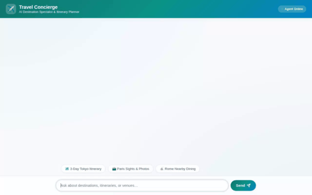

# ✈️ Travel Concierge Agent

An intelligent, multi-tool travel planning agent built with Google's **Agent Development Kit (ADK)**, featuring cross-session memory, live weather & geolocation tools, media generation (Imagen & Omni video), Firestore destination cataloging, and rich **A2UI** dynamic cards.



---

## 🌟 Key Features & Architecture

### 🧠 Cross-Session Memory Bank
- **Vertex AI Memory Bank Service**: Integrates `VertexAiMemoryBankService` and `PreloadMemoryTool` to persist user travel preferences, past trips, and dietary/allergy constraints across sessions.
- **Memory Callback**: Automatically generates and indexes memories after each interaction loop via `after_agent_callback`.

### 🧰 Wired Tools & Integrations
- **Live Weather & Geolocation**: Real-time Open-Meteo weather forecasts and coordinates lookup (`get_live_destination_info`).
- **Google Maps APIs**: Location geocoding (`geocode_address`) and nearby venue discovery (`find_nearby_places`) using Google Maps Places API (New).
- **Firestore Catalog**: Firestore database integration (`firestore.Client`) for searching and adding travel destinations to the `destinations` collection (`get_destinations`, `add_destination`).
- **Trip Budget Calculation**: Python itemized budget breakdowns with live currency conversions (`calculate_trip_budget`).
- **Image Generation**: Generates destination photos using Imagen (`gemini-3.1-flash-lite-image`), uploading bytes to Google Cloud Storage (`gs://travel-concierge-media-c355417df227`) and saving ADK runtime artifacts.
- **Video Generation**: Generates short cinematic destination previews using Google's Omni model (`gemini-omni-flash-preview` in the `global` region), uploading `.mp4` video bytes to Cloud Storage and saving artifacts.
- **Code Execution Sandbox**: Secure Python code sandbox (`AgentEngineSandboxCodeExecutor`) for complex math or data transformations.

### 🎨 Rich A2UI & Custom Frontend
- **A2UI Schema Manager (v0.8)**: Generates system instructions using the Basic Catalog (`Card`, `Column`, `Row`, `Text`, `Image`) and streams UI parts via `after_model_callback`.
- **FastAPI A2A Proxy Frontend**: Minimal FastAPI proxy in `./frontend` communicating with deployed agents over the Agent-to-Agent (A2A) protocol.

---

## 📋 System Requirements & Dependencies

- **Python**: 3.10+
- **Google Cloud Platform**: Project with Vertex AI, Firestore, and Cloud Storage APIs enabled.
- **Environment Variables**:
  - `GOOGLE_GENAI_USE_VERTEXAI=true`
  - `GOOGLE_CLOUD_PROJECT=<your-gcp-project-id>`
  - `GOOGLE_CLOUD_LOCATION=us-east1`
  - `GOOGLE_MAPS_API_KEY=<your-google-maps-api-key>` (Optional)

---

## 🚀 Setup & Local Execution Instructions

### 1. Clone & Install Dependencies
```bash
git clone <your-repository-url>
cd travel-concierge
python -m venv .venv
source .venv/bin/activate
pip install -r requirements.txt
```

### 2. Configure Environment Variables
Create a `.env` file in the root directory:
```bash
GOOGLE_CLOUD_PROJECT=your-gcp-project-id
GOOGLE_CLOUD_LOCATION=us-east1
GOOGLE_GENAI_USE_VERTEXAI=true
GOOGLE_MAPS_API_KEY=your-api-key-here
```

### 3. Run Agent Playground Locally
Start the local ADK Web playground to interact with the agent:
```bash
adk web app:app --port 8000
```

### 4. Run Custom FastAPI Frontend Locally
Navigate to the `frontend/` directory and start the proxy server:
```bash
cd frontend
pip install -r requirements.txt
export AGENT_ENGINE_RESOURCE_NAME="projects/<project-id>/locations/<location>/reasoningEngines/<resource-id>"
export AGENT_DIRECTORY="app"
python main.py
```

---

## 🚀 Deployment

### Deploy Agent to Agent Platform
```bash
agents-cli deploy --update-env-vars GOOGLE_MAPS_API_KEY=$GOOGLE_MAPS_API_KEY --no-confirm-project
```

### Deploy Frontend to Cloud Run
```bash
gcloud run deploy travel-concierge-frontend \
  --source=./frontend \
  --region=us-east1 \
  --set-env-vars AGENT_ENGINE_RESOURCE_NAME="<resource-name>",AGENT_DIRECTORY="app"
```

---

## 📌 Status & Roadmap

### ✅ Implemented
- [x] ADK Root Agent with `gemini-flash-latest`
- [x] Vertex AI Memory Bank persistence & preloading
- [x] Firestore destination catalog lookup (`destinations` collection)
- [x] Google Maps Geocoding & Places (New) integration
- [x] Live weather API integration (Open-Meteo)
- [x] Python trip budget calculator
- [x] Imagen destination photo generation (`gemini-3.1-flash-lite-image`)
- [x] Omni destination video generation (`gemini-omni-flash-preview` in global region)
- [x] Public Google Cloud Storage bucket upload (`gs://travel-concierge-media-c355417df227`)
- [x] ADK A2UI v0.8 Basic Catalog rendering
- [x] FastAPI A2A proxy chat UI

### ⏳ Planned (Not Yet Implemented)
- [ ] Real-time flight booking checkout integration
- [ ] Automated Google Calendar itinerary export
- [ ] Multi-user collaborative trip planning session sync
